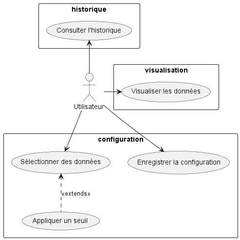

= Documentation Technique Java : WareView
G2A09
20/01/2023
:toc: preamble
:toc-title: Sommaire
:toclevels: 4
:nofooter:

Groupe G2A09

<<<

== Présentation

WareView est une application de visualisation de l'entrepot de l'entreprise de Commerce de la Rue. Cette application est à destination des employés de Commerce de la Rue afin de surveiller l'état de leur entrepôt.

L'application est un client lourd programmé en JavaFX, relié à un script Python de récupération de données.

=== Use Case global

L'application relativement simple ne comporte qu'un seul acteur, l'utilisateur.

Il y a trois parties à l'application, la configuration, la visualisation, et l'historique.

L'utilisateur peut sélectionner dans la configuration les données qu'il souhaite visualiser et dont il souhaite obtenir l'historique.

== Architecture

=== Architecture générale

Voici l'architecture générale de l'application :

image::./architecture.png[architecture application]

L'application est liée à un script Python et lui communique par l'intermédiaire de fichiers `.json`.

L'application Java produit un fichier de configuration lu par le script Python lui indiquant quelles sont les données à récupérer des capteurs ainsi que leur seuil.

Les données sont ensuite lues afin de les historiser ainsi que de les visualiser grâce à JavaFX.

=== Ressources externes utilisées

- Maven, outil de gestion de production de projet Java
- Dépendances :

* JavaFX
* json-simple

=== Structuration des packages

- controller :

Ce package contient les classes controllers, c'est-à-dire les classes associées aux vues fxml permettant la gestion des flux de données.

- main :

Ce package contient seulement la classe principale de lancement de l'application `App.java`.

- model :

- util :

- view :

Ce package contient les ressources `.fxml` qui sont les vues de l'application

Ce package contient les classes qui vont récupérer les différents éléments des fenêtres de l'application, comme les boutons, et va leur donner une action (ex : quand on clique sur un bouton, on va effectuer une certaine action). Ce package contient aussi les fichiers FXML qui seront ensuite récupérés par les classes du package application.control.

// old

- application :

Nous retrouvons dans ce package principal la classe qui permet de lancer l'application (DailyBankApp.java) mais aussi la classe qui permet d'obtenir le statut de l'utilisateur connecté (chef d'agence ou employé).
Un fichier css est aussi présent afin de gérer le style de l'application.

- application.control :

Dans ce package sont présents les classes qui gèrent l'affichage des différentes fenêtres de l'application. Ces classes récupèrent notamment les fichiers fxml qui permettront par la suite de créer la structure des différentes fenêtres de l'application.

- application.tools :

Comme son nom l'indique, ce package contient diverses classes utiles, comme AlertUtilities.java qui va gérer l'affichage de fenêtres d'alerte, ou bien encore des classes qui vont permettre de gérer les crédits ou les débits (CategorieOperation.java).

- application.view :

Ce package contient les classes qui vont récupérer les différents éléments des fenêtres de l'application, comme les boutons, et va leur donner une action (ex : quand on clique sur un bouton, on va effectuer une certaine action). Ce package contient aussi les fichiers FXML qui seront ensuite récupérés par les classes du package application.control.

- model.data :

Ce package contient les classes principales, comme par exemple Client.java ou CompteCourant.java, qui vont être utilisés afin de créer des objets Client et CompteCourant nécessaires au bon fonctionnement de l'application et à la structuration du code.

- model.orm :

Ce package va contenir les classes qui communiquent avec la base de données. Comme classe importante nous pouvons citer AccesClient.java qui va chercher un client dans la base de donnée en fonction de son identifiant, de son age ou de son nom. Nous pouvons aussi noter LogToDatabase.java qui va permettre aux employés de l'agence de se connecter à la base de données afin de gérer les clients.

- model.orm.exception :

Dans ce package sont présents les différentes exceptions que l'application peut lever (erreur de connexion à la base de donnée, erreur de privilège...).

=== Éléments essentiels / spécificités

// Eléments essentiels à connaître, spécificités, … nécessaires à la mise en œuvre du développement. Cette partie peut être illustrée par un diagramme de séquence. Par exemple, une structure récurrente de classes peut être décrite ici (contrôleurs de dialogues, contrôleurs de vue, …), les threads utilisés, ...

LogToDatabase.java
Client.java
CompteCourant.java
AccesClient.java

<<<

== Fonctionnalités

=== Configuration

==== Sélection des données

Sélection des données 

==== Appliquer un palier

Application d'un palier sur une donnée sélectionnée

==== Enregistrer la configuration

Enregistrement de la configuration

=== Visualisation

==== Visualiser les données

=== Historique

==== Rendre inactif un client (Anton)

Rendre inactif un client est une spécificité de la modification d'un client.

L'état actif ou inactif d'un client peut seulement être modifié par un chef d'agence, nous le testons avec la méthode statique `ConstantesIHM.isAdmin(Employe)`.

.ClientEditorPaneController.java
[source,java]  
---- 
if (ConstantesIHM.isAdmin(this.dbs.getEmpAct())) {
    this.rbActif.setDisable(false);
    this.rbInactif.setDisable(false);
} else {
    this.rbActif.setDisable(true);
    this.rbInactif.setDisable(true);
}
----
Les boutons permettant la modification de l'activité sont activés conditionnellement.

clientEdite.estInactif est la variable String indiquant l'état d'activité du client. Sa valeur doit être changée grâce aux constantes `ConstantesIHM.CLIENT_ACTIF` ainsi que `ConstantesIHM.CLIENT_INACTIF`.

Classes impliquées dans chaque package :
    
    application.control:
        - ClientsManagement
        - ClientEditorPane
    application.view:
        - ClientsManagementController
        - ClientEditorPaneController
    model.data:
        - Client
    application.tools:
        - ConstantesIHM

Le diagramme de séquence est identique à celui de Modifier un client car l'activité d'un client est un des attributs modifiables d'un client.

image::../assets/doc_Tec_V1/Rendre inactif un client.png[Diagramme de séquence]

==== Créer un employé (Anton)

Seulement les chefs d'agence ont accès à la gestion des employés.

Pour créer un employé, la fenêtre de dialogue `EmployeEditorPane.java` est appelée depuis la classe `EmployesManagement.java` par la méthode `nouvelEmploye()` avec la constante `EditionMode.CREATION` en paramètre.

La fenêtre `EmployeEditorPane.java` et sa classe controlleur `EmployeEditorPaneController.java` gèrent la création et l'initialisation de l'employé par l'utilisateur, ils  renvoient ensuite l'employé pour l'insérer dans la base de données grâce à la classe `AccessEmploye.java` qui est en charge des requêtes SQL.

Classes impliquées dans chaque package :
    
    application.control:
        - EmployesManagement.java
        - EmployeEditorPane.java
    application.view:
        - EmployesManagementController.java
        - EmployeEditorPaneController.java
    model.data:
        - Employe.java
    model.orm:
        - AccessEmploye.java
    application.tools:
        - ConstantesIHM.java

Voici le diagramme de séquence synthétisant les appels de méthodes dans les différentes classes à partir de la fenêtre principale :

image::../assets/doc_Tec_V1/Créer un employé.png[Diagramme de séquence créer un employé]

=== V2

==== Générer un relevé de compte pdf (Loan)

Pour générer un relevé de compte pdf, la librairie itextpdf a été importée dans le projet. Une nouvelle fenêtre nécessaire au fonctionnement du relevé de compte a aussi été créée en fxml grâce à SceneBuilder et modifiée grâce au controller de cette fenêtre.

Les classes impliquée dans les packages application pour générer un relevé de compte sont :

    application.control :
        - DailyBankMainFrame.java
        - ClientsManagement.java
        - ComptesManagement.java
        - OperationsManagement.java
        - SelectionnerEmplacement.java

    application.tools :
        - AlertUtilities.java
        - CategorieOperation.java
        - EditionMode.java
        - PairsOfValue.java
        - StageManagement.java

    application.view :
        - DailyBankMainFrameController.java
        - ClientsManagementController.java
        - ComptesManagementController.java
        - OperationsManagementController.java
        - SelectionnerEmplacementController.java

Voici le diagramme de séquence depuis l'écran d'accueil pour générer un relevé de compte pdf :

image::../assets/doc_Tec_V2/diagramme_sequence_generer_pdf.png[Diagramme de séquence générer un relevé de compte]

==== Créer un prélèvement automatique (Matthieu)

Pour créer un prélèvement automatique, il faut fournir les informations suivantes :

    - Le nom du bénéficiaire
    - Le jour du prélèvement
    - Le montant du prélèvement

Dans la base de donnée, on agit en écriture pour ajouter le nouveau prélèvement, sur la table PrelevementAutomatique. 

Voici le diagramme de séquence depuis l'écran de gestion des comptes :

image::../assets/doc_Tec_V2/Creer un prelevement.png[Diagramme de séquence créer un prélèvement]

Les classes impliquée dans les packages application pour créer un prélèvement sont :

    application.control :
        - ComptesManagement.java
        - PrelevementEditorPane.java
        - PrelevementsManagement.java

    application.view :
        - ComptesManagementController.java
        - PrelevementEditorPaneController.java
        - PrelevementsManagementController.java

Les classes impliquée dans les packages model pour créer un prélèvement sont :

    model.data :
        - Prelevement.java

    model.orm : 
        - AccessPrelevement.java
    
==== Modifier un prélèvement automatique (Matthieu)

La modification d'un prélèvement est similaire à la création d'un prélèvement et mobilise les même classes.

Lors de la modification d'un prélèvement, les informations suivantes peuvent être modifier :

    - Le nom du bénéficiaire
    - Le jour du prélèvement
    - Le montant du prélèvement

Dans la base de donnée, on agit en lecture pour récupérer les information du prélèvement et en écriture pour ajouter les nouvelles informations du prélèvement, sur la table PrelevementAutomatique. 

Voici le diagramme de séquence depuis l'écran de gestion des comptes :

image::../assets/doc_Tec_V2/Modifier un prelevement.png[Diagramme de séquence modifier un prélèvement]

Les classes impliquée dans les packages application pour créer un prélèvement sont :

    application.control :
        - ComptesManagement.java
        - PrelevementEditorPane.java
        - PrelevementsManagement.java

    application.view :
        - ComptesManagementController.java
        - PrelevementEditorPaneController.java
        - PrelevementsManagementController.java

Les classes impliquée dans les packages model pour créer un prélèvement sont :

    model.data :
        - Prelevement.java

    model.orm : 
        - AccessPrelevement.java

==== Supprimer un prélèvement automatique (Matthieu)

La suppression d'un prélèvement automatique mobilise les mêmes classe que la création et la modification d'un prélèvement.

Dans la base de donnée, on agit en lecture pour récupérer les information du prélèvement à supprimer et en écriture pour supprimer le prélèvement, sur la table PrelevementAutomatique. 

Voici le diagramme de séquence depuis l'écran de gestion des comptes :

image::../assets/doc_Tec_V2/Supprimer un prelevement.png[Diagramme de séquence supprimer un prélèvement]

Les classes impliquée dans les packages application pour créer un prélèvement sont :

    application.control :
        - ComptesManagement.java
        - PrelevementEditorPane.java
        - PrelevementsManagement.java

    application.view :
        - ComptesManagementController.java
        - PrelevementEditorPaneController.java
        - PrelevementsManagementController.java

Les classes impliquée dans les packages model pour créer un prélèvement sont :

    model.data :
        - Prelevement.java

    model.orm : 
        - AccessPrelevement.java

== Installation

=== Développement

- Maven
* Build et Run le projet avec le plugin javafx avec la commande `mvn clean javafx:run`
* Détails dans le pom.xml

=== Utilisateur

