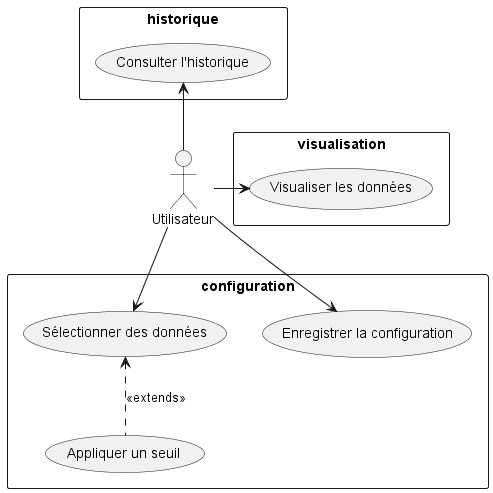
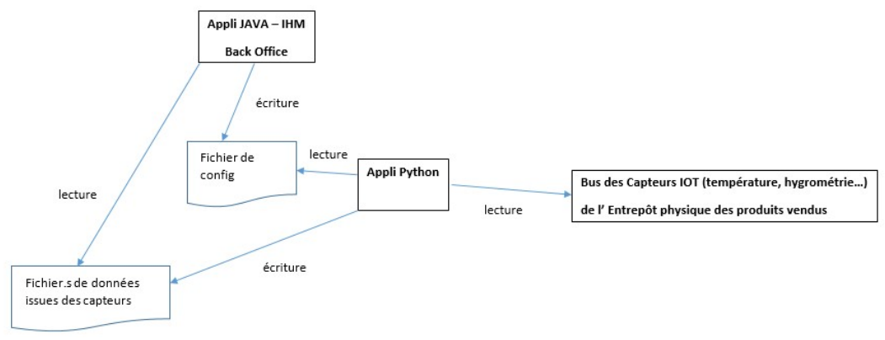
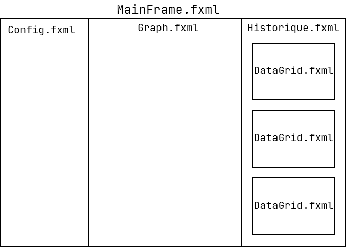
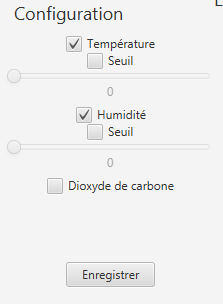
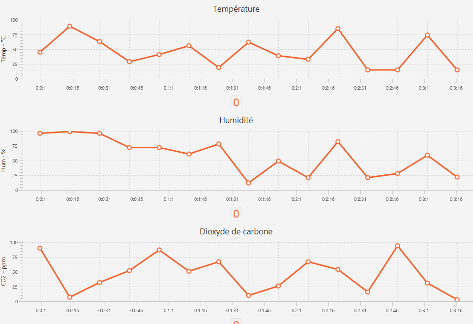
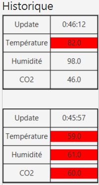

= Documentation Technique Java : WareView
G2A09
20/01/2023
:toc: preamble
:toc-title: Sommaire
:toclevels: 4
:nofooter:

Groupe G2A09

<<<

== Présentation

WareView est une application de visualisation de l'entrepot de l'entreprise de Commerce de la Rue. Cette application est à destination des employés de Commerce de la Rue afin de surveiller l'état de leur entrepôt.

L'application est un client lourd programmé en JavaFX, relié à un script Python de récupération de données.

=== Use Case global

L'application relativement simple ne comporte qu'un seul acteur, l'utilisateur.

Il y a trois parties à l'application, la configuration, la visualisation, et l'historique.

L'utilisateur peut sélectionner dans la configuration les données qu'il souhaite visualiser et dont il souhaite obtenir l'historique.

== Architecture

=== Architecture générale

Voici l'architecture générale de l'application :

L'application est liée à un script Python et lui communique par l'intermédiaire de fichiers `.json`.

L'application Java produit un fichier de configuration `config.json` lu par le script Python lui indiquant quelles sont les données à récupérer des capteurs ainsi que leur seuil.

Les données sont ensuite lues dans le fichier `data.json` afin de les historiser ainsi que de les visualiser grâce à JavaFX.

=== Ressources externes utilisées

- Maven, outil de gestion de production de projet Java
- Dépendances :

* JavaFX
* org.json
* json-simple

=== Structuration des packages

.Structure MVC :
Nous utilisons le modèle d'architecture MVC car elle est la plus adaptée à une application IHM avec une interface utilisateur. +
Celle-ci permet de séparer l'application en packages suivants :

- model

Nous utilisons comme structure de données la class JSONObject provenant de la librairie `org.json`. +
Il n'y a pas eu besoin de créer nos propres classes dans cette application.

Les classes ici sont la partie Model de l'architecture MVC.

- controller :

Ce package contient les classes controllers, c'est-à-dire les classes associées aux vues fxml permettant la gestion des flux de données à travers les différentes vues.

Les classes ici sont la partie Controller de l'architecture MVC.

- main :

Ce package contient seulement la classe principale de lancement de l'application `App.java`.

- util :

Comme son nom l'indique, ce package contient les classes utilitaires dont l'objectif est de

- view :

Ce package contient les ressources `.fxml` qui sont les vues de l'application

Ce package contient les classes qui vont récupérer les différents éléments des fenêtres de l'application, comme les boutons, et va leur donner une action (ex : quand on clique sur un bouton, on va effectuer une certaine action). Ce package contient aussi les fichiers FXML qui seront ensuite récupérés par les classes du package application.control.

Les classes ici sont la partie View de l'architecture MVC.

- model.orm.exception :

Dans ce package sont présents les différentes exceptions que l'application peut lever (erreur de connexion à la base de donnée, erreur de privilège...).

=== Éléments essentiels / spécificités

Voici l'architecture des vues de l'application :

L'application charge d'abord la vue `MainFrame.fxml` dont le contrôleur `MainFrameController` charge les 3 sous-vues :

* Config.fxml
* Graph.fxml
* Historique.fxml

L'historique ensuite charge ensuite d'autres sous-vues `DataGrid.fxml` qui représentent des entrées de données historisées dans l'application.

<<<

== Fonctionnalités

=== Configuration

==== Sélection des données

L'utilisateur peut sélectionner les données qu'il souhaite en cochant les checkbox

Fichiers impliqués dans chaque package :
    
    controller:
        - ConfigController.java
    view:
        - Config.fxml

==== Appliquer un palier

Nous pouvons choisir de definir un palier à l'aide du slider ou tout simple ne pas en mettre. Nous pouvons également choisir quels capteurs nous souhaitons voir sur le graphique

==== Enregistrer la configuration

Pour enregistrer cette configuration et ainsi créer le fichier .json il suffit de valider les paramètres avec le bouton "Enregistrer". 

=== Visualisation

Voici un exemple de représentation graphique obtenue dans l'application. Il s'agit de l'évolution des données obtenues des capteurs à travers le temps, à chaque fois que le bouton "enregistrer" est cliqué, un fichier json est envoyé et le graphique ainsi que la section se trouvant à droite de celui-ci, sont mis à jour.

=== Historique

Affiche les données précédentes sous forme de tableau, permettant la lecture précise des valeurs. +
Met le fond en [red]#rouge# si les valeurs ont dépassé le seuil prédéfini. +
À chaque réception de données, un nouvel élément est ajouté, il alors possible de défiler pour voir les précédentes.

== Installation

=== Développement

- Maven
* Build et Run le projet avec le plugin javafx avec la commande `mvn clean javafx:run`
* Détails dans le pom.xml

=== Utilisateur

* Lancer le script Python `script_mqtt.py`
** Consulter la documentation utilisateur si besoin 
* Lancer l'application Java `java -jar WareView.jar`