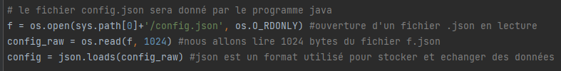
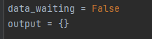
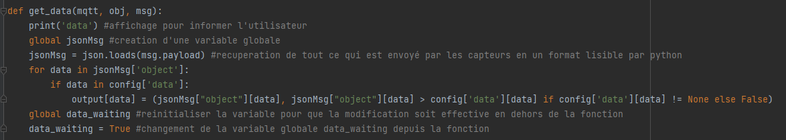
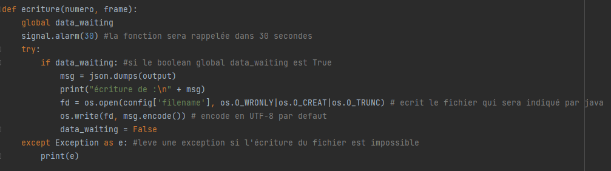
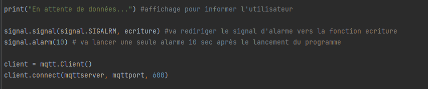
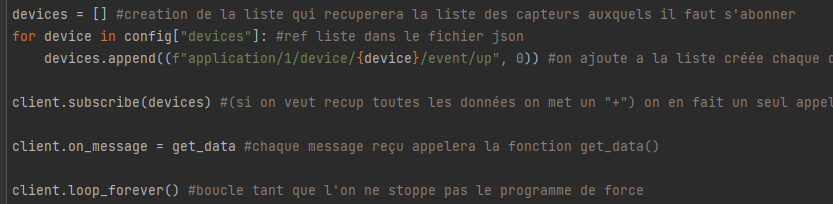

= SAE DevApp : Document d'installation et d'utilisation du script Python
Groupe G2A9
16/12/2022
:toc: auto
:toc-title: Sommaire
:toclevels: 4
:title-separator: any
:source-highlighter: highlightjs
:nofooter:

Oryann Prochaska +
Thomas Demeyere +
Anton Xu +
Louis Yvelin 

toc::[]

<<<

== sae_mqtt.py

sae_mqtt.py est un script Python permettant de lire des données envoyées par des capteurs et d'en extraire les données désirées.

== Installation

=== Prérequis

* Fichier `config.json` de configuration du script
* Être sur un système d'exploitation UNIX/Linux
* Python 3+

=== Installation de paho-mqtt

Dans la ligne de commande exécuter la commande +
`pip install paho-mqtt`

== Utilisation

=== Exécution du script Python

Dans la ligne de commande exécuter le script : +
`python sae_mqtt.py`

=== Documentation

Le script Python récupère les données voulues et les exporte
au  format .json`. Pour cela on s'abonne au flux MQTT du réseau LoRa de l'IUT de Blagnac avec les codes suivants :

image::partie_1.png[partie 1]
nous avons besoin du nom du serveur mqtt ainsi que le numero du port.

Par la suite nous ouvrons un fichier json qui sera par la suite généré par un programme java. Pour le moment celui-ci a été écrit en dur.

Nous l'ouvrons en lecture afin de récupérer les données qu'il contient. Le texte est décomposé en byte (octets) nous indiquons au programme que nous souhaitons lire les 1024 premiers bytes.

La troisième étape consiste à définir une variable de type booleen afin de savoir après les appels de fonction si les données ont pu être chargées.

Nous initialisons un dictionnaire de données vide afin de récupérer les valeurs.

Dans une quatrième partie notre travail consistera à définir une fonction permettant de réceptioner les données envoyées sur le flux MQTT. 

Cette fonction changera par la même occasion la variable globale initialisée plus tôt data_waiting. Cette modification nous servira à enchaîner sur une autre fonction par la suite. Nous parcourons le fichier .json 

Cette autre fonction est celle qui s'occupera d'écrire les données dans le dictionnaire vide créé au début.

Dans les première lignes on indique que la fonction se rappelera elle même toutes les 30 secondes. On effectue un test sur la variable globale data_waiting afin de savoir si il y a des données puis on écrit dans un fichier vide 'filename'. Nous assurons la gestion d'exceptions avec un 'except'. La variable data_waiting est remise à false.

Nous écrivons le programme principal qui se chargera d'appeler les fonctions avec les vrais fichiers.
Nous appelons des signaux afin de déclencher l'appel de la fonction, nous mettons en place l'abonnement aux capteurs choisis.

Pour finir nous pouvons boucler à l'inifini sur le programme jusqu'a un arrête forcé (exemple ctrl+q).

