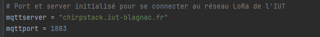

= SAE DevApp : Document d'installation et d'utilisation du script Python
Groupe G2A9
16/12/2022
:toc: auto
:toc-title: Sommaire
:toclevels: 4
:title-separator: any
:source-highlighter: highlightjs
:nofooter:

Oryann Prochaska +
Thomas Demeyere +
Anton Xu +
Louis Yvelin 

toc::[]


<<<

== script_mqtt.py

script_mqtt.py est un script Python permettant de lire des données envoyées par des capteurs et d'en extraire les données désirées.

== Installation

=== Prérequis

* Fichier `config.json` de configuration du script
* Être sur un système d'exploitation UNIX/Linux
* Python 3+

=== Installation de paho-mqtt

Dans la ligne de commande exécuter la commande +
`pip install paho-mqtt`

== Utilisation

=== Exécution du script Python

Dans la ligne de commande exécuter le script : +
`python script_mqtt.py`

=== Structure du code

==== Initialisation variables
Le script Python récupère les données voulues et les exporte
au  format `.json`. +
Pour cela on s'abonne au flux MQTT du réseau LoRaWAN de l'IUT de Blagnac avec les codes suivants :


.Nous avons besoin du nom du serveur mqtt ainsi que le numéro du port.

Nous initialisons une variable de type booléen afin de savoir lors des appels de fonction si des données nouvelles ont pu être récupérées. +
Nous initialisons aussi un dictionnaire de données vide afin de récupérer les valeurs.

image::partie_3.png[partie 3]

==== Définition fonctions
Nous définissons premièrement une fonction de chargement du fichier de configuration :
```py
def load_config():
    global config
    # le fichier config.json sera donné par le programme java
    f = os.open(sys.path[0]+'/config.json', os.O_RDONLY) #ouverture d'un fichier .json en lecture
    config_raw = os.read(f, 1024) #nous allons lire 1024 bytes du fichier f.json
    config = json.loads(config_raw) #json est un format utilisé pour stocker et echanger des données il prend en paramètre un tableau de bytes cette fonction retourne un objet python
    os.close(f)
```
Nous l'ouvrons en lecture avec `os.open` afin de récupérer les données qu'il contient. Nous indiquons au programme que nous souhaitons lire les 1024 premiers bytes avec la fonction `os.read`.


Ensuite, nous définissons une fonction appelée à chaque nouveau message du flux MQTT, permettant de stocker ses données dans le dictionnaire initialisé au début, en rechargeant au préalable le fichier de configuration : 
```py
def get_data(mqtt, obj, msg):
    print('data') #affichage pour informer l'utilisateur
    load_config() #relecture du fichier de configuration
    global jsonMsg #creation d'une variable globale
    jsonMsg = json.loads(msg.payload) #recuperation de tout ce qui est envoyé par les capteurs en un format lisible par python
    for data in jsonMsg['object']:
        if data in config['data']:
            # tuple (valeur, True/False selon si le seuil configuré a été dépassé ou non)
            output[data] = (jsonMsg["object"][data], jsonMsg["object"][data] > config['data'][data] if config['data'][data] != None else False)
    global data_waiting #reinitialiser la variable pour que la modification soit effective en dehors de la fonction
    data_waiting = True #changement de la variable globale data_waiting depuis la fonction
```
Cette fonction changera par la même occasion la variable globale data_waiting initialisée plus tôt. Cette modification nous servira à indiquer à la fonction d'écriture qu'il y a effectivement de nouvelles données en attente d'écriture.

Cette dernière fonction d'écriture est celle qui s'occupera d'écrire les données dans un fichier json :
```py
def ecriture(numero, frame):
    global data_waiting
    signal.alarm(30) #la fonction sera rappelée dans 30 secondes
    try:
        if data_waiting: #si le boolean global data_waiting est True
            msg = json.dumps(output)
            print("écriture de :\n" + msg)
            fd = os.open(sys.path[0]+config['filename'], os.O_WRONLY|os.O_CREAT|os.O_TRUNC) # crée ou ouvre le fichier d'ecriture des données
            os.write(fd, msg.encode()) # encode en UTF-8 par defaut
            os.close(fd)
            data_waiting = False
    except Exception as e: #leve une exception si l'écriture du fichier est impossible
        print(e)
```
Dans les première lignes on indique que la fonction se rappelera elle-même toutes les 30 secondes. On effectue un test sur la variable data_waiting afin de savoir si il y a des données en attente d'écriture. Si c'est le cas, on ouvre un fichier avec `os.open` et on les écrit dedans avec `os.write`. La variable data_waiting est remise à False.

==== Initialisation du script

Il reste à

Nous mettons en place premièrement le premier si
```py

signal.signal(signal.SIGALRM, ecriture) #va rediriger le signal d'alarme vers la fonction ecriture
signal.alarm(10) # va lancer une seule alarme 10 sec après le lancement du programme

client = mqtt.Client()
client.connect(mqttserver, mqttport, 600)

client.subscribe("application/1/device/+/event/up") #on en fait un seul appel pour s'abonner aux topics (lien) présents dans la liste devices

client.on_message = get_data #chaque message reçu appelera la fonction get_data()

print("En attente de données...") #affichage pour informer l'utilisateur

client.loop_forever() #boucle tant que l'on ne stoppe pas le programme de force
```
Nous mettons en place l'abonnement aux capteurs du fichier de configuration.

image::partie_7.png[partie 7]


